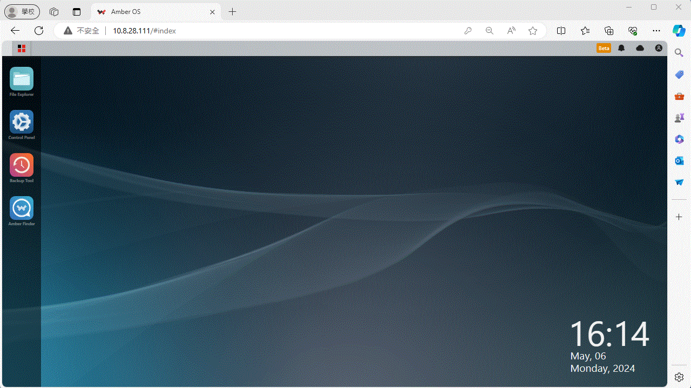

English

<h1>📚 Degirum ORCA on Amber OS </h1>

## Table of Contents

- [Table of Contents](#table-of-contents)
- [Installation Guide](#-installation-guide)
	- [PRO Tools installation](#-protools-installaiton)
	- [DeGirum Client installation](#-dgclient-installaiton)
- [Getting Started](#-getting-started)
- [Run DeGirum Notebooks](#-run-degirum-notebooks)
	- [To Launch a Single Notebook with Cloud Key](#to-launch-degirum_cloud)
	- [To Launch a Single Notebook with Local IP](#to-launch-degirum_ip)
- [Troubleshooting](#️-troubleshooting)
- [FAQ](#-faq)


<div id='-installation-guide'/>

## Installation Guide

<div id='-protools-installaiton'/>

## PRO Tools installation
1. Login Amber OS.
2. Click "Control Pannel" -> "Pro Tools" -> "Install Now" -> "Apply".



<div id='-dgclient-installaiton'/>

## Degirum Client installation
1. Login Amber OS.
2. Click "Pro Tools" -> "App Store"
3. Input "degirum" -> click search. 
4. Click "Install" -> "OK".


<div id='-getting-started'/>

## Getting Started

1. Sign up for an AmberCloud account(https://myamber.cloud/#ln/signup).
2. Install [Pro Tools](#-protools-installaiton).  
3. Install [DeGirum Client](#-dgclient-installaiton) 
4. Sign up for an account on DeGirum Cloud Portal and Log in. (https://cs.degirum.com)
5. Study the DeGirum Development Tools(inclued pySDK,AI Models and on-line documents) are available on the Cloud Platform(https://docs.degirum.com/content/).
6. Explore Degirum Jupyter notebooks using github URL (https://github.com/DeGirum/PySDKExamples), select one related to your needs or give them all a try. Good Luck!

To install to the new release version, please run `python -m pip install degirum --extra-index-url https://degirum.github.io/simple` in degirum client container. 

If you run into issues, please check the [troubleshooting section](#-troubleshooting), [FAQs](#-faq)
If you need help on pySDK and AI models convert issues, please start a GitHub discussions.(https://github.com/DeGirum/PySDKExamples/discussions).  


<div id='-run-degirum-notebooks'/>

## Run DeGirum Notebooks
```
git clone https://github.com/DeGirum/PySDKExamples.git
cd PySDKExamples
pip install -r ./requirements.txt
```


<div id='to-launch-degirum_cloud'/>

## To Launch a Single Notebook with Cloud Key

Create cloud API access token on Tokens page of DeGirum Cloud Portal(https://cs.degirum.com/profile#profile-tab-tokens).

```
import degirum as dg         # import DeGirum PySDK package
# connect to DeGirum cloud platform and use DeGirum public model zoo
zoo = dg.connect(dg.CLOUD, "https://cs.degirum.com", "<my cloud API access token>")
print(zoo.list_models())     # print all available models in the model zoo

# load mobilenet_ssd model for CPU; model_name should be one returned by zoo.list_models()
model_name = "mobilenet_v2_ssd_coco--300x300_quant_n2x_cpu_1"     
model = zoo.load_model(model_name, image_backend='pil')

# perform AI inference of an image specified by URL
image_url = "https://raw.githubusercontent.com/DeGirum/PySDKExamples/main/images/TwoCats.jpg"
result = model(image_url)

print(result)                # print numeric results
result.image_overlay.show()  # show graphical results
```


<div id='to-launch-degirum_ip'/>

## To Launch a Single Notebook with Local IP
```
import degirum as dg         # import DeGirum PySDK package
# connect to Local Degirum Server
AmberOS_docker_host_IP = '172.17.0.1' 
zoo = dg.connect(AmberOS_docker_host_IP)
print(zoo.list_models())     # print all available models in the model zoo

# load mobilenet_ssd model for CPU; model_name should be one returned by zoo.list_models()
model_name = "mobilenet_v2_ssd_coco--300x300_quant_n2x_orca1_1"     
model = zoo.load_model(model_name, image_backend='pil')

# perform AI inference of an image specified by URL
image_url = "https://raw.githubusercontent.com/DeGirum/PySDKExamples/main/images/TwoCats.jpg"
result = model(image_url)

print(result)                # print numeric results
result.image_overlay.show()  # show graphical results
```


<div id='-troubleshooting'/>

## Troubleshooting

<div id='#-faq'/>

## FAQ
- [FAQ](#-faq)